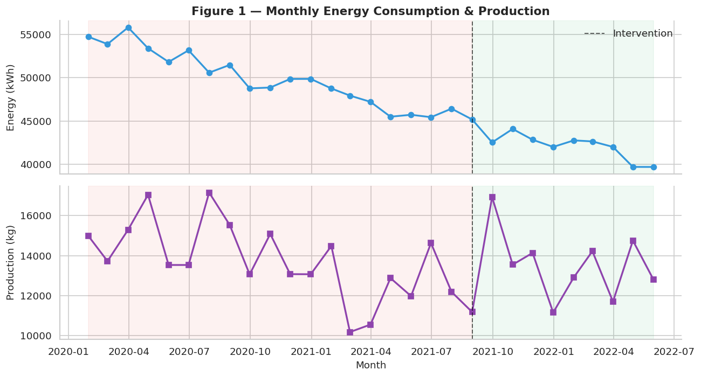
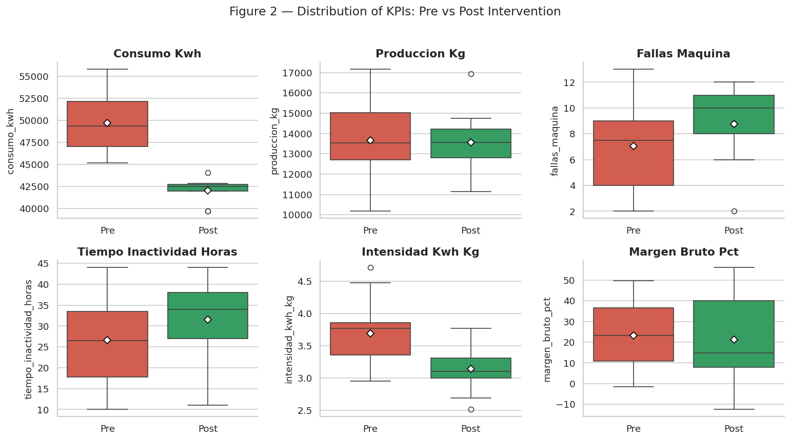
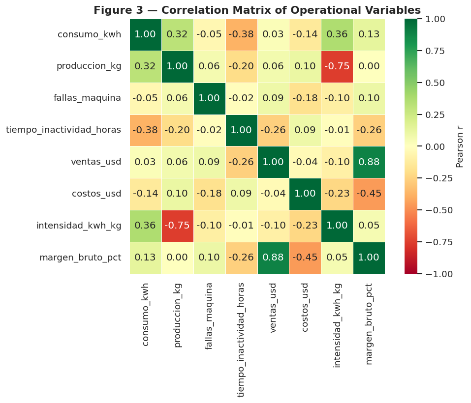
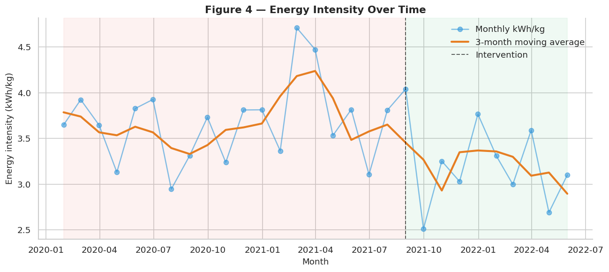
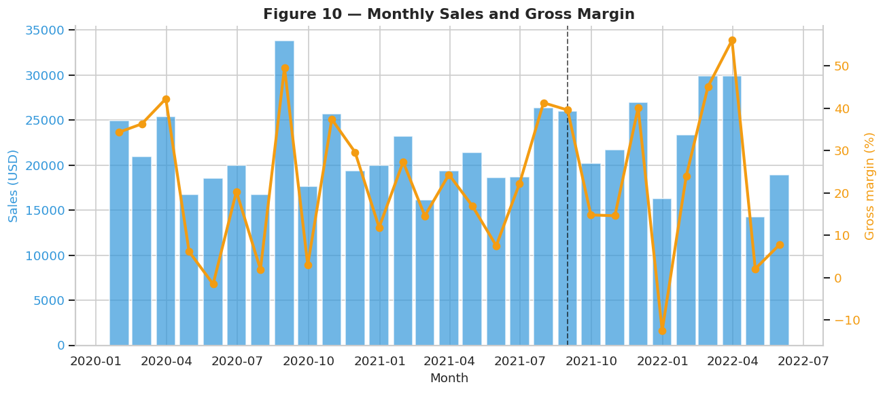

# 1. Exploratory Data Analysis

!!! info "Companion notebook"
    `notebooks/01_exploratory_data_analysis.ipynb` — runnable end-to-end with `make notebook`.

This chapter reproduces **Section 4** of the closure report. It loads
the dataset, computes descriptive statistics by period, and produces
five visualizations (Figures 1, 2, 3, 4 and 10 in the closure report).

## Descriptive statistics by period

The first step is to compute the mean, standard deviation, and percentage
change for every KPI, split by Pre and Post intervention.

```python
from panificadora import load_dataset
from panificadora.eda import describe_by_period

df = load_dataset()
stats = describe_by_period(df)
```

| KPI | Mean Pre | Mean Post | Change |
| --- | ---: | ---: | ---: |
| `consumo_kwh` | 49,702.82 | 42,023.36 | **−15.45 %** |
| `intensidad_kwh_kg` | 3.69 | 3.14 | **−14.95 %** |
| `produccion_kg` | 13,656.95 | 13,571.44 | −0.63 % |
| `fallas_maquina` | 7.05 | 8.78 | +24.51 % |
| `tiempo_inactividad_horas` | 26.55 | 31.56 | +18.85 % |
| `ventas_usd` | 21,471.25 | 22,381.78 | +4.24 % |
| `margen_bruto_pct` | 23.27 | 21.34 | **−8.29 %** |

!!! warning "Two report-vs-dataset discrepancies"
    The closure report cites a −18.2 % energy reduction and a +8.2 pp
    margin improvement. The recomputed dataset values are **−15.5 %**
    and **−2.0 pp** respectively. See [Key Findings](../findings.md) for
    a full discussion.

## Figure 1 — Monthly time series

Energy consumption (top) and production (bottom) over the 29-month
period. The vertical dashed line marks August 2021. The clear downward
shift in kWh after the cutoff is the headline visual evidence.

{ .center }

## Figure 2 — Pre vs Post distributions

Box plots compare each KPI between the two periods. White diamonds
indicate the means. Note how `consumo_kwh` and `intensidad_kwh_kg`
clearly shift downward while `fallas_maquina` and
`tiempo_inactividad_horas` actually *increase* post-intervention — an
expected commissioning effect.

{ .center }

## Figure 3 — Correlation matrix

Pearson correlation across all KPIs. The strongest positive correlation
is between `fallas_maquina` and `consumo_kwh`, validating the field
hypothesis that failing machinery was a primary energy waster.

{ .center }

## Figure 4 — Energy intensity

kWh per kg produced — the single most important efficiency KPI. The
3-month moving average smooths month-to-month noise. The downward trend
accelerates visibly after August 2021.

{ .center }

## Figure 10 — Sales and gross margin

Monthly sales (bars) and gross margin percentage (line). Note that the
margin does not rise as the closure report claims — the dataset shows a
slight decline, contradicting the report's secondary claim.

{ .center }

## Key takeaways

1. **Energy reduction is visually unmistakable** in the time series.
2. **Energy intensity drops ~15 %**, confirming the efficiency gain.
3. **Correlations validate the field diagnosis** (failures ↔ consumption).
4. **The margin improvement claimed by the report is not in the data** —
   surfaced here as a deliberate exercise in reproducible research.

→ Next: [Chapter 2 — Anomaly Detection](02-anomalies.md)
