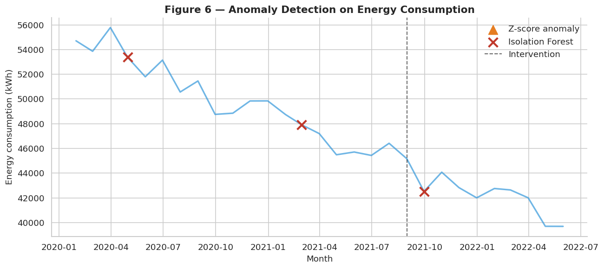
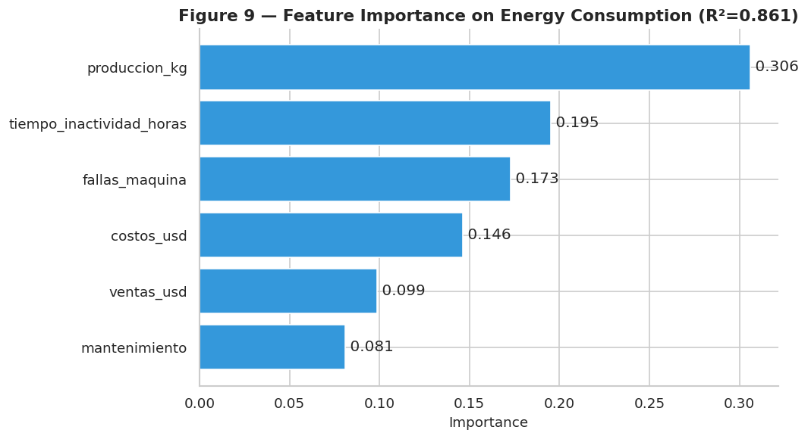

# 2. Anomaly Detection

!!! info "Companion notebook"
    `notebooks/02_anomaly_detection.ipynb`

This chapter reproduces **Section 5** of the closure report. It combines
two complementary methods to flag months with atypical operations, then
uses Random Forest feature importance to rank what drives energy use.

## Method 1 — Z-score (univariate)

For each month, $Z = (x - \mu) / \sigma$. Flag when $|Z| > 2.0$.

```python
from panificadora.anomaly import zscore_anomalies

flags = zscore_anomalies(df["consumo_kwh"], threshold=2.0)
n_anomalies = flags.sum()
```

With the default threshold of 2.0 the method detects **0 anomalies** —
the monthly energy series, taken alone, does not exhibit extreme
univariate outliers. Lowering the threshold to 1.5 surfaces a handful of
points; this trade-off is explored interactively in the
[dashboard](../dashboard.md).

## Method 2 — Isolation Forest (multivariate)

Isolation Forest is an unsupervised algorithm that isolates anomalies by
recursively partitioning the feature space. Anomalies are isolated with
fewer splits than normal points. Configuration:

| Parameter | Value | Justification |
| --- | --- | --- |
| `n_estimators` | 200 | Stable convergence on small datasets |
| `contamination` | 0.10 | Expect ~10 % anomalous months |
| `random_state` | 42 | Reproducibility |
| Features | 5 | kWh, kg, failures, downtime, intensity |

```python
from panificadora.anomaly import isolation_forest_anomalies

flags = isolation_forest_anomalies(df)
df_anomalies = df[flags][["fecha", "consumo_kwh", "fallas_maquina"]]
```

This identifies **3 anomalous months**, all clustered in the Pre-intervention
period and coinciding with high failure counts — exactly the months the
field engineers had flagged as problematic.

## Figure 6 — Anomalies on the time series

Triangle markers (orange) indicate Z-score anomalies; X markers (red)
indicate Isolation Forest anomalies. The clustering in the Pre period
validates the field diagnosis.



## Why combine the two methods

| Z-score alone | Isolation Forest alone | Combined |
| --- | --- | --- |
| Catches univariate outliers | Catches multivariate combinations | Catches both |
| Sensitive to single-variable spikes | Robust to scaling | Comprehensive |
| Easy to interpret | Opaque (ML) | Two perspectives |

The two methods make different assumptions about what "anomalous" means.
Reporting both protects against the blind spot of any single approach.

## Feature importance — what drives consumption?

A Random Forest regressor predicts monthly `consumo_kwh` from the other
operational variables. Its built-in feature importances tell us where to
prioritize attention for future optimization.

```python
from panificadora.anomaly import feature_importance_energy

importances, r2 = feature_importance_energy(df)
print(f"R² on training set: {r2:.3f}")
print(importances)
```

The model achieves a high in-sample R² (the dataset is too small to
hold out a meaningful test set). The importance ranking is the actionable
output:



`fallas_maquina` and `produccion_kg` dominate as predictors — consistent
with field intuition: equipment failures and production volume jointly
explain most of the variation in energy use.

## Key takeaways

1. **Both methods agree** that the anomalous months belong to the Pre period.
2. **Isolation Forest catches multivariate patterns** that Z-score misses,
   demonstrating the value of method combination.
3. **Failures are the top predictor** of energy consumption — addressing
   them was the right intervention target.

→ Next: [Chapter 3 — Statistical Tests](03-statistics.md)
