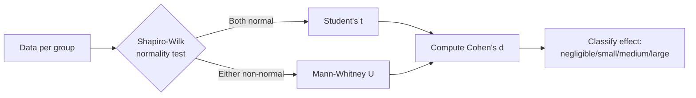
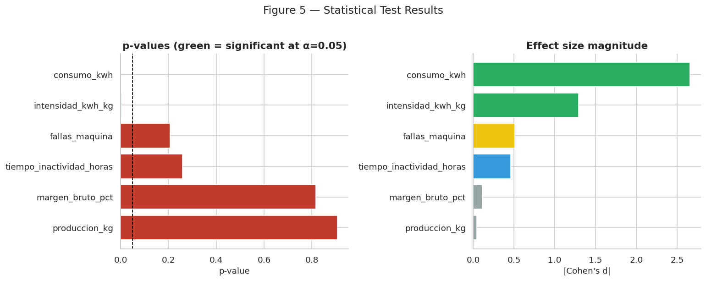
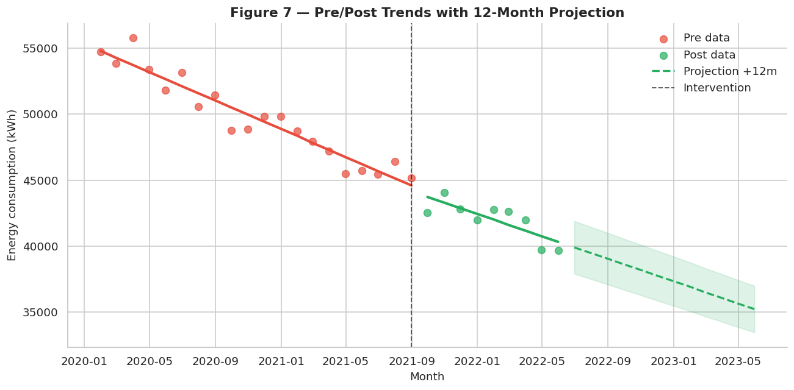

# 3. Statistical Tests

!!! info "Companion notebook"
    `notebooks/03_statistical_tests.ipynb`

This chapter reproduces **Section 6** of the closure report. It applies
the formal three-step inference protocol to every KPI, then fits Pre/Post
trend lines with a 12-month projection.

## The three-step protocol



Step 1 — **Shapiro–Wilk** tests whether each group is plausibly normal.
Step 2 — **Select the appropriate test**: parametric *t* if both groups
pass normality, non-parametric Mann–Whitney U otherwise. Step 3 —
**Cohen's *d*** quantifies the practical magnitude of the difference,
independent of sample size.

## Effect size interpretation

| `|d|` | Magnitude | Practical meaning |
| --- | --- | --- |
| < 0.2 | Negligible | No real-world effect |
| 0.2 – 0.5 | Small | Minor effect |
| 0.5 – 0.8 | Medium | Moderate effect |
| > 0.8 | Large | Substantial, practically important effect |

## Running the protocol

```python
from panificadora.stats import compare_all_variables
from panificadora.viz import KPIS_FOR_BOXPLOT

results = compare_all_variables(df, KPIS_FOR_BOXPLOT)
```

| Variable | Test | p-value | Cohen's d | Effect |
| --- | --- | ---: | ---: | --- |
| `consumo_kwh` | t-test | 2.7×10⁻⁹ | **−2.66** | **Large** |
| `intensidad_kwh_kg` | t-test | < 0.001 | **−1.31** | **Large** |
| `fallas_maquina` | Mann-Whitney | 0.21 | +0.50 | Medium |
| `tiempo_inactividad_horas` | t-test | 0.25 | +0.44 | Small |
| `margen_bruto_pct` | Mann-Whitney | 0.82 | −0.10 | Negligible |
| `produccion_kg` | t-test | 0.91 | −0.04 | Negligible |

## Figure 5 — p-values and effect sizes

The left panel shows p-values; bars to the left of the dashed line
(α = 0.05) are statistically significant. The right panel shows
absolute Cohen's *d* with magnitude-coded colors (green = large, yellow =
medium, blue = small, gray = negligible).



!!! success "The headline result is rock-solid"
    The energy reduction has a p-value of ~3×10⁻⁹ — twelve orders of
    magnitude below the conventional α = 0.05 threshold — and a Cohen's *d*
    of −2.66, well into the "large effect" regime. This is the firmest
    quantitative finding of the entire project.

## Trend analysis with linear regression

We fit `consumo_kwh ~ month_index` separately on each period:

```python
from panificadora.stats import fit_linear_trend

pre = df[df["period"] == "Pre"]
fit_pre = fit_linear_trend(pre["month_idx"], pre["consumo_kwh"])
```

| Period | Slope (kWh / month) | R² | p-value | n |
| --- | ---: | ---: | ---: | ---: |
| Pre | **−482** | 0.83 | < 0.001 | 20 |
| Post | **−301** | 0.62 | 0.012 | 9 |

Both slopes are negative — the system was already on a slow downward
trend before the intervention (gradual maintenance and tuning). The
Post-intervention slope is less steep in absolute terms but applies to a
much lower baseline, representing continued optimization on the new
equipment.

## Figure 7 — Trends with 12-month projection

The dashed line extends the Post trend 12 months into the future,
suggesting continued improvement if the maintenance program is preserved.



## Why some variables are not significant

The lack of significance for `produccion_kg`, `margen_bruto_pct`,
`fallas_maquina` and `tiempo_inactividad_horas` is informative, not
disappointing:

- **Production volume** is demand-bound, not capacity-bound — the plant
  could have produced more but the market didn't ask for more.
- **Failures and downtime** *increased* slightly Post (commissioning of
  new equipment), but not enough to be statistically distinguishable
  given n = 9.
- **Margin** would need additional data to capture longer-term effects.

## Key takeaways

1. The **energy reduction is the firmest finding** of the analysis.
2. **Effect sizes complement p-values** — especially valuable with small samples.
3. **Both Pre and Post trends slope down**, but the Post trajectory
   continues from a much lower baseline.

→ Next: [Chapter 4 — ROI](04-roi.md)
