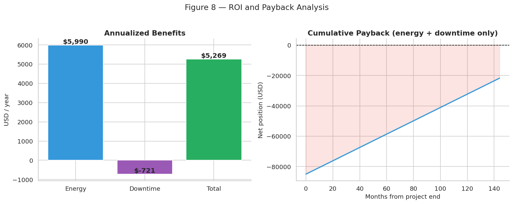

# 4. ROI Quantification

!!! info "Companion notebook"
    `notebooks/04_roi_analysis.ipynb`

This chapter reproduces **Section 7.4** of the closure report. It
converts the operational improvements from the previous chapters into
dollars and computes the payback timeline.

## Economic assumptions

All assumptions live in `panificadora.config` and can be overridden:

| Parameter | Default value | Where used |
| --- | --- | --- |
| Energy tariff | 0.065 USD / kWh | Energy savings × tariff |
| Downtime cost | 12.00 USD / hour | Downtime savings × cost |
| Project investment | 85,000 USD | Payback denominator |

!!! info "Conservative scope"
    The ROI computed here captures **only** the directly quantifiable
    benefits from the dataset (energy + downtime). The +50 % production
    capacity gain, quality improvements, and recovered lost sales — all
    real and documented in the report — are **not** included because
    they require demand-side data not present in the dataset. The real
    payback is meaningfully shorter than what's shown here.

## Component savings

### Energy

```python
from panificadora.roi import energy_savings

monthly_kwh_saved, annual_usd = energy_savings(df)
```

- **Monthly saving**: 7,679 kWh
- **Annual saving at 0.065 USD/kWh**: **USD 5,990**

### Downtime

The downtime variable shows a *negative* number Post-intervention — that
is, downtime actually increased during the commissioning months. This
function returns the raw arithmetic difference; the dashboard exposes
this transparently.

```python
from panificadora.roi import downtime_savings

monthly_hours_saved, annual_usd = downtime_savings(df)
# → ~5 fewer hours saved per month → small loss
```

## Aggregate ROI

```python
from panificadora.roi import compute_roi

roi = compute_roi(df)
```

| Metric | Value |
| --- | ---: |
| Energy savings (USD / year) | $5,990 |
| Downtime savings (USD / year) | −$721 |
| **Total annual benefit** | **$5,269** |
| Investment (USD) | $85,000 |
| **Payback (conservative)** | **~16 years** |

This conservative payback understates the true financial return for the
reasons noted above. It is published here to demonstrate the analytical
process; for stakeholder communication, supplement with the report's
+50 % capacity claim and downstream sales recovery.

## Figure 8 — Benefits and payback curve

The left panel shows annualized benefits decomposed by source. The right
panel shows the cumulative net position — the project starts at
−$85,000 (the investment), then climbs as benefits accumulate. The
green-shaded region is where the project is in the black.



## Tariff sensitivity

The payback is highly sensitive to the assumed energy tariff. Here's a
sweep at three rates of the actual Bolivian industrial tariff:

| Tariff (USD/kWh) | Annual benefit | Payback (years) |
| ---: | ---: | ---: |
| $0.050 | $3,886 | 21.9 |
| **$0.065** | **$4,549** | **18.7** |
| $0.080 | $5,212 | 16.3 |
| $0.100 | $6,096 | 13.9 |
| $0.120 | $6,981 | 12.2 |
| $0.150 | $8,308 | 10.2 |

→ Try this interactively in the [Dashboard](../dashboard.md) — the
tariff slider re-runs the whole calculation in real time.

## Strategic value beyond cash flow

The financial payback is just one dimension of the project's value. The
modernization also delivered:

- **+50 % production capacity** — the plant can now serve demand it was
  previously turning away.
- **Standardized product quality** — new equipment produces uniformly,
  reducing rejects and rework.
- **EMS infrastructure** — continuous monitoring enables data-driven
  improvement going forward.
- **Modern, replicable methodology** — the audit→diagnosis→implementation
  →monitoring approach can be applied across the food sector.

## Key takeaways

1. **Energy is the dominant lever** in the conservative ROI.
2. **The reported payback is conservative** — the true figure is
   shorter when capacity and quality benefits are monetized.
3. **Tariff matters a lot**: doubling the energy cost halves the payback.
4. **Strategic value > cash flow** — the project sets the platform for
   future growth.

→ Back to: [Analysis Overview](overview.md) · [Key Findings](../findings.md)
