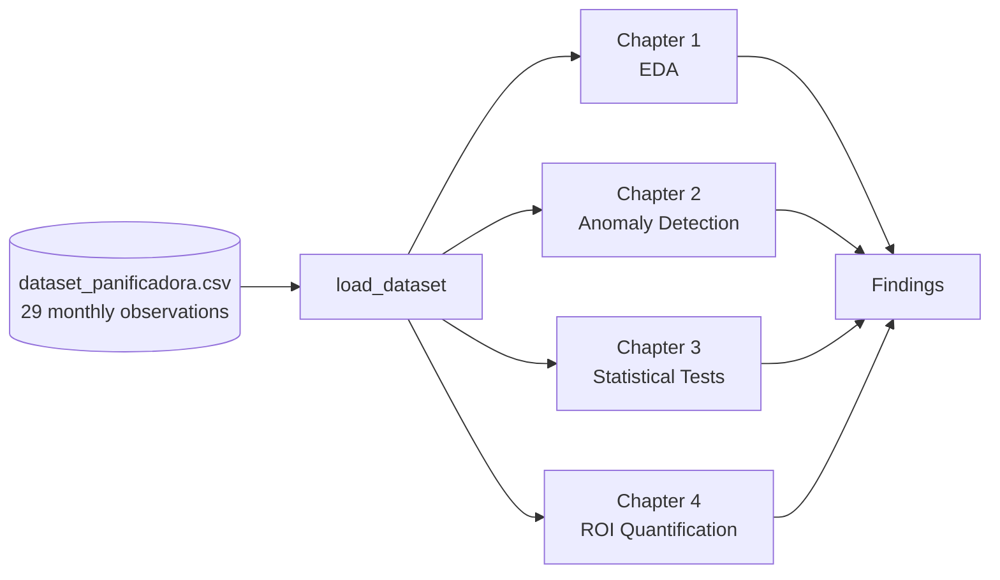

# The Analysis — Overview

The analysis mirrors the structure of the original closure report. It
unfolds in **four chapters**, each a self-contained Jupyter notebook
that imports computational functions from `src/panificadora/`.

## Chapters

-   :material-magnify-scan:{ .lg .middle } **[1. Exploratory Data Analysis](01-eda.md)**

    ---

    Descriptive statistics by period, time-series visualization,
    distribution comparison, correlation matrix, energy-intensity tracking.

    *Reproduces Figures 1, 2, 3, 4 and 10 of the closure report.*

-   :material-bug-outline:{ .lg .middle } **[2. Anomaly Detection](02-anomalies.md)**

    ---

    Univariate detection via Z-score and multivariate detection via
    Isolation Forest. Random Forest feature-importance ranking.

    *Reproduces Figures 6 and 9.*

-   :material-chart-bell-curve:{ .lg .middle } **[3. Statistical Tests](03-statistics.md)**

    ---

    Shapiro–Wilk normality → Student's *t* or Mann–Whitney U →
    Cohen's *d* effect size. Linear regression for trend analysis.

    *Reproduces Figures 5 and 7.*

-   :material-cash-multiple:{ .lg .middle } **[4. ROI Quantification](04-roi.md)**

    ---

    Energy and downtime savings, payback curve, tariff sensitivity.

    *Reproduces Figure 8.*

## Methodology in one paragraph

The dataset contains **29 monthly observations** spanning January 2020 to
May 2022. The cutoff between Pre and Post intervention is set at **August
2021**, when the new machinery became fully operational — this leaves 20
months of Pre data and 9 months of Post data. Every analytical step is
performed by a pure function in `src/panificadora/`, tested in
`tests/test_*.py`, surfaced interactively in the [dashboard](../dashboard.md),
and called from the four notebooks. Plots are generated in **both**
matplotlib (static, saved to `reports/figures/`) and Plotly (interactive,
embedded in notebooks and dashboard).

## What's deterministic and what's not

| Component | Deterministic? | Notes |
| --- | --- | --- |
| Data loading & feature engineering | ✅ | Pure pandas |
| Descriptive statistics & correlations | ✅ | Closed-form |
| Z-score anomaly detection | ✅ | Closed-form |
| Statistical tests (Shapiro, t, MWU, d) | ✅ | scipy.stats |
| Linear regression | ✅ | OLS via scipy |
| Isolation Forest | ✅ * | `random_state=42` fixed |
| Random Forest (feature importance) | ✅ * | `random_state=42` fixed |
| ROI calculation | ✅ | Closed-form |

*\* The two ML components use a fixed random seed (`config.RANDOM_STATE = 42`),
so re-runs produce identical outputs.*
