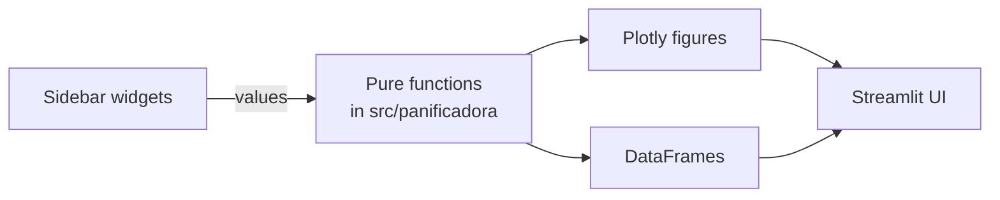

# Interactive Dashboard

The repository ships with a Streamlit dashboard that exposes the entire
analysis with live parameter tuning.

## Launching

```bash
make dashboard
# or directly:
streamlit run dashboard/app.py
```

The app opens at `http://localhost:8501`.

## Sidebar controls

The sidebar groups every interactive parameter:

=== "ROI parameters"

    | Control | Range | Default | Effect |
    | --- | --- | --- | --- |
    | Energy tariff | $0.030 – $0.200 / kWh | $0.065 | Recomputes annual savings |
    | Project investment | $10k – $500k | $85,000 | Re-scales payback |
    | Downtime cost | $5 – $50 / hour | $12 | Adjusts downtime savings |

=== "Anomaly detection"

    | Control | Range | Default | Effect |
    | --- | --- | --- | --- |
    | Z-score threshold |Z| | 1.0 – 4.0 | 2.0 | Lower → more anomalies |
    | IF contamination | 0.01 – 0.30 | 0.10 | Expected fraction of outliers |
    | IF n_estimators | 50 – 500 | 200 | More trees → more stable |

=== "Period filter"

    Show data for **Pre**, **Post**, or **Both**. Affects the correlation
    matrix and intensity views.

## Tabs

<div class="grid cards" markdown>

-   :material-view-dashboard:{ .lg .middle } **📈 Overview**

    Four headline KPI cards (consumption, intensity, annual benefit,
    payback) that **recompute live** as the sidebar sliders move.
    Monthly time series and sales/margin figures below.

-   :material-magnify:{ .lg .middle } **🔬 EDA**

    Pre/Post descriptive statistics table, Plotly boxplots,
    correlation matrix, and energy intensity over time.

-   :material-bug:{ .lg .middle } **🔍 Anomalies**

    Z-score and Isolation Forest re-fit **live** with your tuning
    parameters. Three live metrics show how many anomalies each method
    flags. Filterable detail table plus feature importance.

-   :material-chart-bell-curve:{ .lg .middle } **📐 Statistics**

    Color-graded hypothesis-test table (p-values shaded green/red),
    p-value & effect-size figure, regression trends with projection.

-   :material-cash-multiple:{ .lg .middle } **💰 ROI**

    ROI metrics that recompute every time you move a slider. Payback
    curve, tariff sensitivity sweep, and a notice about the
    conservative scope.

-   :material-database:{ .lg .middle } **📋 Data**

    Raw dataset viewer with a CSV download button.

</div>

## Architecture

The dashboard contains **zero analytical logic of its own**. Every chart
and metric is computed by calling functions from `src/panificadora/`.
Streamlit's `@st.cache_data` ensures that heavy computations (Isolation
Forest, Random Forest) run only when their inputs change.



This means: every change you make to `src/panificadora/` is reflected
immediately in the dashboard, the notebooks, and the tests. The
[API Reference](api/config.md) documents every public function.

## Deployment options

For a public demo, the dashboard can be deployed to:

- **[Streamlit Community Cloud](https://streamlit.io/cloud)** — free
  tier, connects directly to GitHub. Add a small `streamlit_config.toml`
  if you want to customize.
- **[Hugging Face Spaces](https://huggingface.co/spaces)** — free,
  supports Streamlit out of the box.
- **A small VPS or container** — for production use behind nginx.
